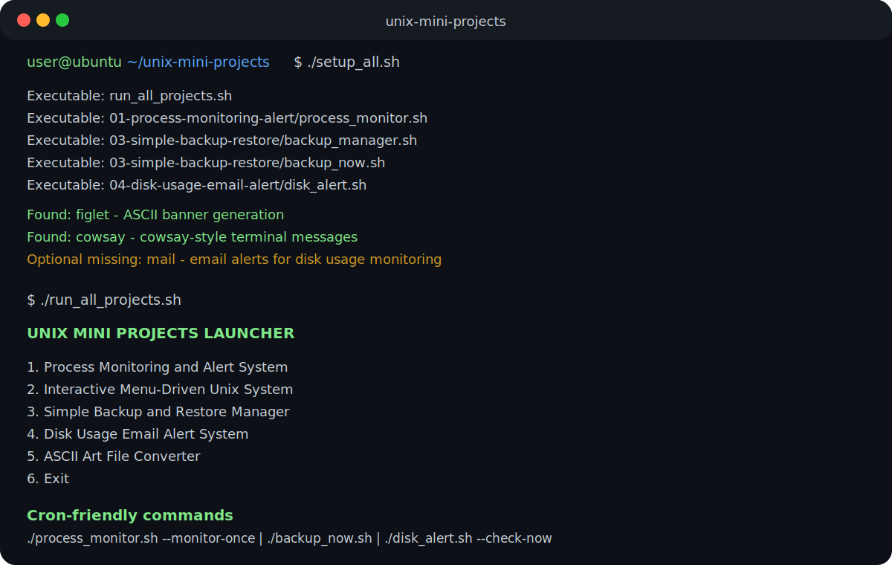

# Unix Mini Projects

A collection of practical Unix/Linux shell scripting mini projects focused on automation, monitoring, file handling, system administration, and terminal-based utilities.

This repository is designed to demonstrate Bash scripting fundamentals through multiple small but useful command-line projects. Each mini project is placed in its own folder with its own script, configuration files, logs, sample data, and README where applicable.

---

## Sample Output



---

## Repository Overview

This repository currently contains five Unix shell scripting projects, one setup script, one master launcher script, non-interactive automation commands, and cron automation examples:

| No. | Project/File | Main Purpose |
|---|---|---|
| 1 | Process Monitoring and Alert System | Monitor selected processes/services and log their status |
| 2 | Interactive Menu-Driven Unix System | Provide a terminal dashboard for common system tasks |
| 3 | Simple Backup and Restore Manager | Create, list, restore, and delete compressed backups |
| 4 | Disk Usage Email Alert System | Check disk usage and generate alerts when limits are crossed |
| 5 | ASCII Art File Converter | Generate and save terminal ASCII banners/messages |
| 6 | `setup_all.sh` | Prepare scripts and check optional tools |
| 7 | `run_all_projects.sh` | Open all mini projects from one top-level menu |
| 8 | `CRON_EXAMPLES.md` | Show examples for scheduling scripts automatically |

---

## Quick Setup

Run this once after cloning the repository:

```bash
chmod +x setup_all.sh
./setup_all.sh
```

The setup script:

- Adds execute permission to all main scripts
- Checks optional tools such as `mail`, `figlet`, `cowsay`, and `shellcheck`
- Prints install hints for macOS and Ubuntu/Debian
- Prints cron-friendly command examples

---

## Master Launcher

The repository includes a top-level launcher script:

```text
run_all_projects.sh
```

This script allows users to open any mini project from one menu.

### How to Run the Master Launcher

```bash
./run_all_projects.sh
```

---

## Cron-Friendly Commands

The repository now includes commands that can run without opening interactive menus:

```bash
./01-process-monitoring-alert/process_monitor.sh --monitor-once
./03-simple-backup-restore/backup_now.sh
./04-disk-usage-email-alert/disk_alert.sh --check-now
./04-disk-usage-email-alert/disk_alert.sh --view-report
```

These are useful for cron jobs, scheduled automation, or quick terminal checks.

---

## Cron Automation Examples

Cron examples are documented in:

```text
CRON_EXAMPLES.md
```

That file includes examples for:

- Running disk usage checks every hour
- Running disk usage checks daily
- Scheduling automatic backups
- Running process monitoring every 15 minutes
- Saving cron output to log files

---

## Project 1: Process Monitoring and Alert System

A shell script that checks whether selected processes are running, logs their status, and optionally alerts or restarts stopped services.

### Features

- Checks whether selected processes are running
- Uses a configuration file for service/process definitions
- Logs process status with timestamps
- Alerts when a selected process is stopped
- Supports optional restart commands
- Works with macOS/Linux-style terminal commands
- Supports `--monitor-once` for explicit non-interactive execution

---

## Project 2: Interactive Menu-Driven Unix System

A modular menu-driven shell scripting project that provides a terminal-based interface for common Unix/Linux administration tasks.

### Features

- File management tools
- Network tools
- System information tools
- Process management tools
- Disk and memory tools
- Modular script structure
- Shared utility functions

---

## Project 3: Simple Backup and Restore Manager

A Unix shell scripting project that provides a backup and restore workflow using compressed `.tar.gz` archives.

### Features

- Create compressed backups of a configured source directory
- List available backup archives
- Restore selected backups
- Delete old backups with confirmation
- View backup logs
- Change source directory for the current session
- Automatically rotate old backups based on a maximum backup limit
- Includes `backup_now.sh` for non-interactive backup creation

---

## Project 4: Disk Usage Email Alert System

A shell script that monitors disk usage and generates an alert when usage crosses a configured threshold.

### Features

- Check disk usage for selected mount points
- Custom threshold configuration
- Save timestamped log messages
- Generate disk usage reports
- Optional desktop notifications
- Optional email alerts using the `mail` command
- Menu-driven interface
- Supports `--check-now` and `--view-report` command-line modes

---

## Project 5: ASCII Art File Converter

A terminal utility that generates ASCII art banners and fun command-line messages using tools such as `figlet` and `cowsay`, with fallback formatting when those tools are not installed.

### Features

- Generate ASCII banners from user input
- Generate cowsay-style terminal messages
- Convert a text file into multiple ASCII banners
- Save generated banners into output files
- Preview output files from the terminal
- Check whether optional tools are installed
- Fallback formatting if optional tools are missing

---

## Technologies Used

- Bash scripting
- Unix/Linux terminal commands
- Process monitoring commands
- File and directory operations
- Logging
- Configuration files
- `tar` compression
- `df` disk usage monitoring
- Optional `mail`, `figlet`, `cowsay`, and `shellcheck` commands
- Cron automation examples

---

## Repository Structure

```text
Unix Mini Projects/
├── 01-process-monitoring-alert/
│   ├── process_monitor.sh
│   ├── services.conf
│   ├── README.md
│   └── logs/
├── 02-interactive-menu-system/
│   ├── main_menu.sh
│   ├── modules/
│   ├── utils/
│   ├── reports/
│   └── README.md
├── 03-simple-backup-restore/
│   ├── backup_manager.sh
│   ├── backup_now.sh
│   ├── config/
│   ├── backups/
│   ├── logs/
│   ├── restored_files/
│   ├── sample_data/
│   └── README.md
├── 04-disk-usage-email-alert/
│   ├── disk_alert.sh
│   ├── config/
│   ├── logs/
│   ├── reports/
│   └── README.md
├── 05-ascii-art-file-converter/
│   ├── ascii_converter.sh
│   ├── config/
│   ├── outputs/
│   ├── sample_inputs/
│   └── README.md
├── screenshots/
│   └── sample-output.svg
├── setup_all.sh
├── run_all_projects.sh
├── CRON_EXAMPLES.md
├── README.md
├── UPGRADE_PLAN.md
└── .gitignore
```

---

## Suggested Demo Order

For a portfolio or viva demonstration, the best order is:

1. Run `setup_all.sh` to show preparation and optional tool checks.
2. Run `run_all_projects.sh` to show the master launcher.
3. Run `disk_alert.sh --check-now` to show non-interactive monitoring.
4. Run `backup_now.sh` to show automated backup creation.
5. Run `process_monitor.sh --monitor-once` to show process monitoring automation.
6. Show the interactive menu project.
7. End with ASCII Art Converter as a lighter utility project.

---

## Why This Repository Is Useful

This repository demonstrates practical Unix/Linux scripting ability through multiple focused mini projects rather than a single isolated script. It shows how Bash can be used for real tasks such as monitoring, backup automation, disk usage checks, system reports, terminal utilities, setup workflows, and cron-style automation planning.

---

## Resume Summary

Created a collection of Unix shell scripting projects including process monitoring, menu-driven system administration, backup and restore automation, non-interactive backup execution, disk usage alerts, cron-friendly command-line modes, ASCII art file conversion, setup automation, cron scheduling examples, and a master launcher using Bash, configuration files, logging, terminal commands, and practical automation workflows.
